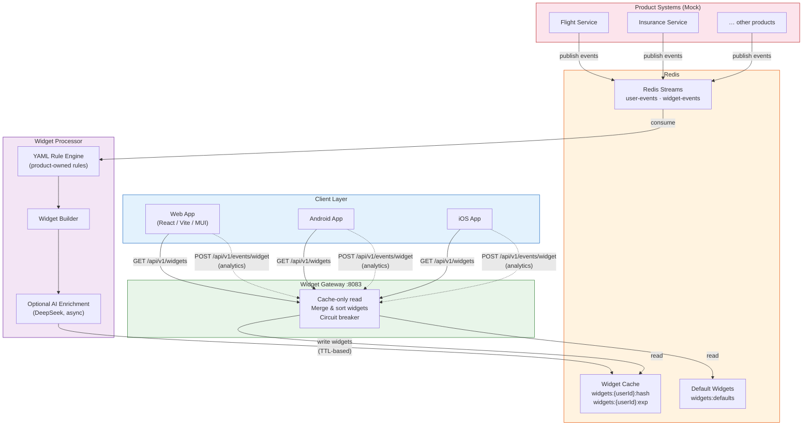
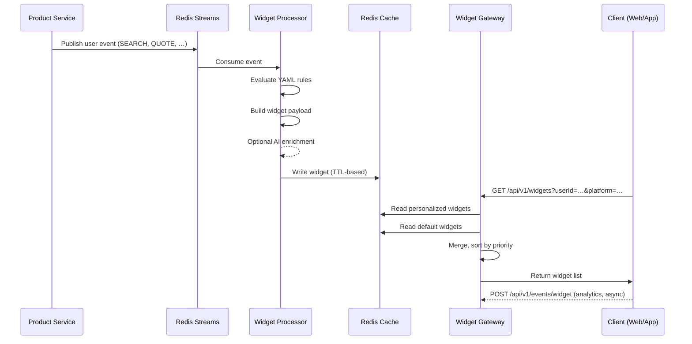
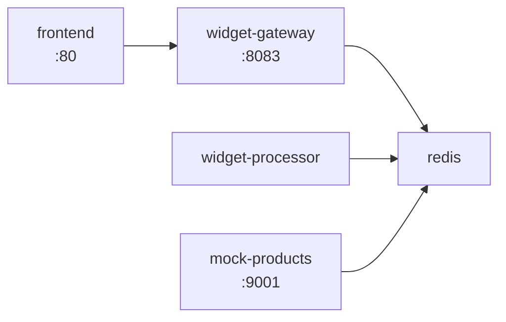

## 1. Executive Summary

**Goal:**  
Imagine opening CHECK24 on your phone and quickly searching for flights to Munich. Later that evening, you open your laptop to continue your search. Instead of starting from scratch, you see personalized widgets showing relevant flights based on your earlier activity. That seamless, consistent experience across all devices is our goal.

Now zoom out: Each CHECK24 product operates as an independent system with its own data and operational limits. The Home page, however, receives traffic that can dwarf any individual product. If Home directly requested personalized widget content from dozens of backend products during peak load, it would accidentally become a traffic amplifier.

Ex: A single user opening the Home page could trigger 30+ backend calls. Now imagine this on peak times like Black Friday—the load would be catastrophic.

**Solution Overview:**  
Products publish events and own widget logic (rules/templates). Core consumes events, generates widgets asynchronously, and stores them in a TTL-based cache. Home reads from cache only → no load amplification and no cascading failures.

---

## 2. Repository Deliverables

- **Concept:** `CONCEPT.md`
- **Developer guide:** `DEVELOPER_GUIDELINE.md`
- **Android Apk** homewidegts-android.apk in the main branch / android code in a separate branch feature/frontend-android 
- **Live PoC (Web Home):** http://64.226.105.176/?userId=123&userName=Ahmed
- **Live PoC (Widgets API):** http://64.226.105.176:8083/api/v1/widgets?userId=400&platform=WEB
---

## 3. PoC Summary

This PoC implements **(Event + Rules)**:

1) Product services emit **user events**
2) Core **Widget Processor** consumes events from **Redis Streams**
3) Processor evaluates **product-owned YAML rules** and builds widgets
4) Widgets are written to **Redis cache (per user)**
5) Home clients fetch from **Gateway (cache-only)**

---

## 4. Quick Demo

Fetch widgets:
```bash
curl "http://165.22.27.127:8083/api/v1/widgets?userId=400&platform=WEB"
````
## 5. Run Locally

```
docker compose up -d --build
```

## 6. Architecture

### System Overview



### Data Flow



### Component Map

| Component | Tech Stack | Role |
|-----------|-----------|------|
| **Widget Gateway** | Java 17, Spring Boot, Redis, Resilience4j | Serves widgets from cache; no product calls |
| **Widget Processor** | Java 17, Spring Boot, Redis Streams, Jackson YAML | Consumes events, evaluates rules, builds & caches widgets |
| **Shared** | Java library | Common DTOs (`WidgetCacheDto`, `Platform`, etc.) |
| **Web Frontend** | React 19, Vite, MUI, Tailwind CSS | Home page rendering widgets by `componentType` |
| **Android App** | Kotlin, Jetpack Compose | Native widget rendering with schema gating |
| **Mock Products** | Node.js, Express, ioredis | Simulates flight/insurance event emission |
| **Redis** | Redis 7 (Streams + Cache) | Event transport, per-user widget storage with TTL |

### Docker Compose Topology



---


## 7. Run Android
- To run android app : you can use the apk or run the code on Android Studio

- To switch user in the android app use the following command: 
```
adb shell am start -W \                             
  -n com.example.check24_android/.MainActivity \
  -a android.intent.action.VIEW \
  -d "check24://home?userId=123\&userName=Ahmed"
```


